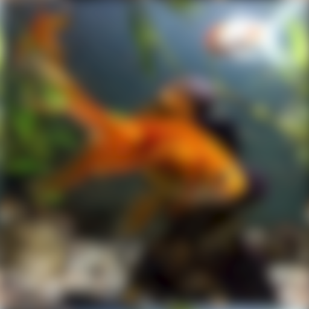

[Link to the code](AcuityView Lesson.R)  

1. View of a cat by a mouse from 1 meter away to 3 meters away

  

  

  

2. View of a mouse by an eagle 1 meter away to 3 meters away

  

  

  

3. View of a spiderweb by a fly from 1 meter away to 3 meters away

  

  

  

4. View of a flower by a bee from 1 meter away to 3 meters away

  

  

  

5. View of a goldfish by another goldfish from 1 meter away to 3 meters away

  

  

  

