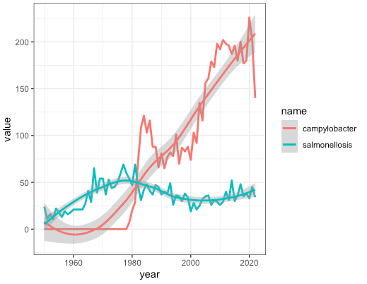

```{r setup, include=FALSE}
knitr::opts_chunk$set(echo = TRUE)
```

## The code I wrote for this assignment is located [here](Rentrez Homework.R)

### Search results retrieved from pubmed

34777280                               
title           "Waterborne Isolates of <i>Campylobacter jejuni</i> Are Able to Develop Aerotolerance, Survive Expos" [truncated]
pubdate         "2021"                                                  
fulljournalname "Frontiers in microbiology"                                                                                   
31658662                          
title           "Comparative Analysis of Aerotolerance, Antibiotic Resistance, and Virulence Gene Prevalence in C" [truncated]
pubdate         "2019 Oct 10"                      
fulljournalname "Microorganisms"                                                                                             
                31270309                                  
title           "Aerotolerance and multilocus sequence typing among Campylobacter jejuni strains isolated from human" [truncated]
pubdate         "2019 Aug 24"                                    
fulljournalname "The Journal of veterinary medical science"                                                                    
                25968890                                
title           "PerR controls oxidative stress defence and aerotolerance but not motility-associated phenotypes of " [truncated]
pubdate         "2015 Jul"                                         
fulljournalname "Microbiology (Reading, England)"                                                                              
                18515414                                
title           "The Campylobacter jejuni thiol peroxidases Tpx and Bcp both contribute to aerotolerance and peroxid" [truncated]
pubdate         "2008 Aug"                             
fulljournalname "Journal of bacteriology"                                                                                      
                11267778                                                                                
title           "The iron-induced ferredoxin FdxA of Campylobacter jejuni is involved in aerotolerance."
pubdate         "2001 Mar 15"                                                                           
fulljournalname "FEMS microbiology letters"                                                           
                10438747                                                                                                         
title           "An iron-regulated alkyl hydroperoxide reductase (AhpC) confers aerotolerance and oxidative stress r" [truncated]
pubdate         "1999 Aug"                                                                                                       
fulljournalname "Journal of bacteriology"                                                                                    
                3214811                                                                                                          
title           "Effect of incubation temperature, ageing, and bisulfite content of unsupplemented Brucella agar on " [truncated]
pubdate         "1988 Sep"                                                                                                       
fulljournalname "Canadian journal of microbiology"                                                                          
                4086409                                                                                                          
title           "Effect of free-radical and oxygen scavengers on photochemically generated oxygen toxicity and on th" [truncated]
pubdate         "1985 Nov"                                                                                                       
fulljournalname "The Journal of applied bacteriology"```

### Plot

