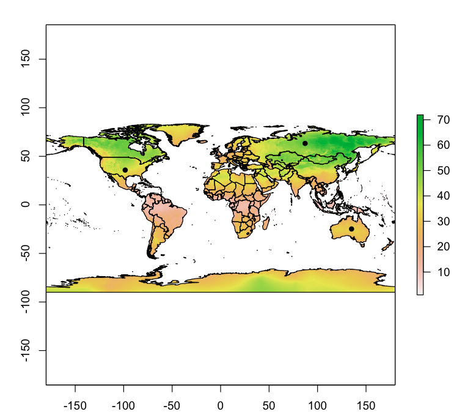
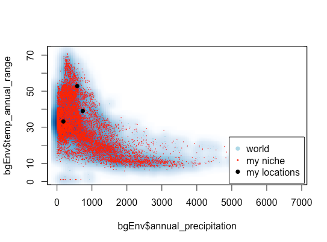

1. Present a map of your climate niche with your selected locations highlighted.  
  

2. Present a scatter plot of two of your selected variables for the world as a whole, your climate niche, and your selected points.  

  

3. Provide a link to the R script you used to calculate you climat eniche and generate the maps and plots.  

[Link to my code](GIS practice.R)  

