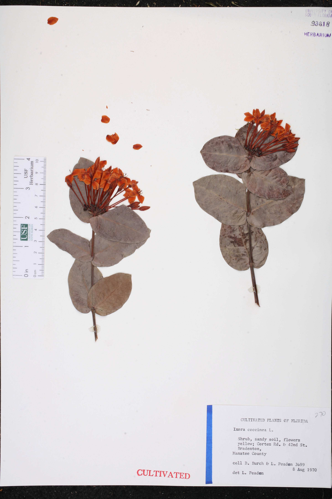
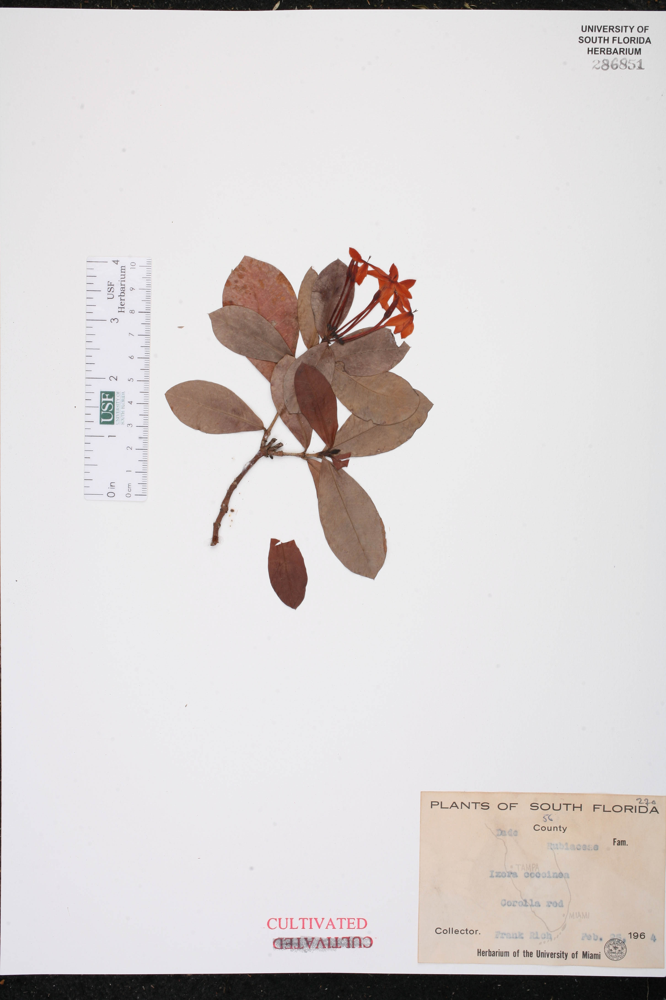
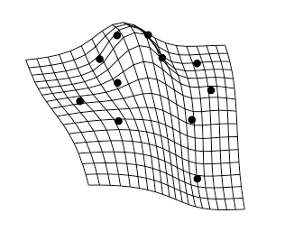
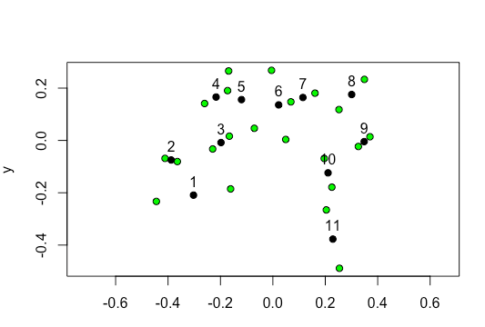

1. Chose two images of the same animal and compare a morphological feature through landmarking (at least ten landmark points.

[Link to the code](geomorph.R)

The images being analyzed are below. These are flowers from the *Ixora coccinea* plant. Scales included in the images. 

2. Make a plot with either plotAllSpecimens or plotRefToTarget (points, vector, or TPS method)

  

