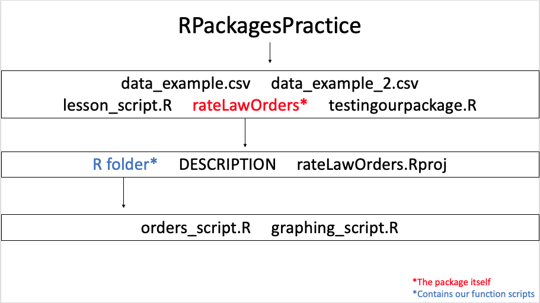

## Download Files

[First Data Example](data_example.csv)  
[Second Data Example](data_example_2.csv)

Download these files and place them into a new folder titled "RPackagePractice". 

## Purpose of an R Package

If you are repeatedly performing the same type of analysis on data that you collected, you may find it helpful to create your own R package that will allow you to use the same collection of R functions over and over for your analysis.

The functions that you create to store in the package are the code that you plan to use repeatedly. After loading your package, you will be able to call any functions that you need to use for your analysis and use them with your data. 

Your package will have at least one file with the extension .R which will contain the package's functions. Usually, you will divide the functions among multiple .R files, with each function having its own R script file. This allows you to document each function individually. 


## Diagram of Directories




## Creating the .R Function Files

Let's create our package.

First, create a new folder for your package. Directories can get confusing when creating a package!

I am creating a folder called "RPackagePractice". 

We will use two example datasets to test our project. Please download data_example.csv and data_example_2.csv and place them into your RPackagePractice folder. 

Then, we will create an R script inside RPackagePractice called “lesson_script” and add the following code:

```
install.packages(c("devtools", "roxygen2"))
library("devtools") # for 'create_package' function now, and other functions later
library("roxygen2") # automatically generates some of the package documentation for you

#pause here to make sure your working directory is set to your packages project folder. It's important to have the correct working directory before the next step!

create_package("rateLawOrders")

```

Then go into the folder named R and create an R script called “orders_script”. This will be one of the functions in our package. Add the following code to create the function for this package:

```
#' Add First Order and Second Order Columns
#'
#' Takes absorbance or concentration data for a reaction and finds the first order and second order values so that all possible order plots can be graphed later
#' @name all_orders
#' @param dataset The dataset for which we are converting, containing a Time and Absorbance column
#' @return A new table with the following columns: Time, zero_order, first_order, second_order
#' @examples all_orders(dataset)

library("dplyr") #to allow us to use the 'mutate' and 'rename' functions

all_orders <- function(dataset) {
  mutate (dataset,
          first_order = log(Absorbance),
          second_order = 1/Absorbance
  ) %>%
    rename (zero_order = Absorbance)
}
```

So that's one of our functions. Now let's add another which will plot the data for us. For organizational purposes, we will put this function into a separate R script file called "graphing_script". Add the following code to it:

```
#' Create Zero Order, First Order, and Second Order Plots
#'
#' Uses the available data to create plots for each rate law order. Useful for checking to see which plot is most linear in order to determine the order of the reaction with respect to that reactant.
#' @name plot_orders
#' @param dataset The dataset for which we are converting, which should already have columns added for the first order and second order data. The expected columns are Time, zero_order, first_order, and second_order. 
#' @return Three plots, one for a zero orderreaction , one for first order, and one for second order.
#' @examples plot_orders(dataset_here)

library("ggplot2")
library("patchwork")

plot_orders <- function(dataset) {

zero_plot <- ggplot(data=dataset, aes(x=Time, y=zero_order, group=1)) +
  geom_line()+
  geom_point()

first_plot <- ggplot(data=dataset, aes(x=Time, y=first_order, group=1)) +
  geom_line()+
  geom_point()

second_plot <- ggplot(data=dataset, aes(x=Time, y=second_order, group=1)) +
  geom_line()+
  geom_point()

all_plots <- (zero_plot + first_plot) / second_plot
all_plots
}

```


Now we need to edit our description file. Go to the rateLawOrders folder and click on the file titled DESCRIPTION.

The description follows the following basic format:  
Package: Name of the package goes here. This should contain only letters and numbers.  
Title: One line description of the package  
Description: More detailed paragraph description of the package  
Version: Current version of the package. For a package in development, we use 
"0.0.0.9000".  
Authors@R: Name and email of authors involved in creating the package, using the following code: person("first name", "last name", email = "email", role ="role"). There should be at least one person with the role of "cre" - this is the "maintainer" of the package, and the person that should be contacted if there are any issues encountered while using the package.  
License: Type of license, usually open source, which specifies how your package can be used. Not necessary if you don't plan to share your package with others  

Here's a description that you can paste into the file for this package: 

```
Package: rateLawOrders
Title: Create zero order, first order, and second plots based on absorbance data
Version: 0.0.0.9000
Authors@R: person("Elise", "Delaporte", email = "elisead@utulsa.edu", role = "cre")
Description: Takes absorbance and time data for a reaction and finds the first order and second order values. Then creates the zero order, first order, and second order plots. 
Encoding: UTF-8
Roxygen: list(markdown = TRUE)
RoxygenNote: 7.2.2
License: use_mit_license()

```

Now go back to "lesson_script.R" and run the following bit of code:

```
# these following functions must be run while your working directory is set to the package folder (i.e. rateLawOrders in this case)
document() # from devtools package, updates the package's documentation
check() # from devtools package, checks package for errors
```

Now to test the package. Set the working directory back to “RPackagePractice” and create an R script titled testingourpackage. Add the following code to it:

```
library("tidyverse") #to allow us to use the 'read_csv' function

dataset1 <-read_csv("data_example.csv")
dataset2 <-read_csv("data_example_2.csv")

glimpse(dataset1)
glimpse(dataset2)

library("devtools") # for 'install' and 'load_all' functions

# set working directory back to RPackagePractice
# because you can't install a package from inside of itself
# which I found out the hard way

install("rateLawOrders")
search() #to see that our package is installed
load_all("rateLawOrders")

# let's check that our documentation for each function worked
?all_orders 
?plot_orders

dataset1_orders <- all_orders(dataset1)
plot_orders(dataset1_orders)

dataset2_orders <- all_orders(dataset2)
plot_orders(dataset2_orders)

```

To load your package later on during a different R session, you should be able to use the following code. Note that you need a copy of your package folder in your current working directory in order to use the package. 

```
library("devtools")

load_all("rateLawOrders")
```


## Interesting In-Depth Resources 

We won't be covering these in detail, but these topics are helpful if you plan to share your packages with others 

[Using Version Numbers](https://r-pkgs.org/lifecycle.html) (major.minor.patch format)  
[Including Datasets Within your Package](https://r-pkgs.org/data.html) (ex. the starwars dataset in dplyr)  
[Licensing](https://r-pkgs.org/license.html) (who is allowed to use your package and how)  

## Lesson/Practice

1. Create your own package from scratch using the process shown here. You can create any type of function to put in it. Add comments to each line of code that you use to show that you know what it does.
2. Don't forget to edit the DESCRIPTION file and use the document() function to create documentation.
3. Create a separate script file to test your package and check its documentation.

## References/Additional Resources

[Lesson on Creating R Packages](http://swcarpentry.github.io/r-novice-inflammation/08-making-packages-R/index.html) - Short tutorial on creating a package. Referenced to create this lesson  

[Book on Creating R Packages](https://r-pkgs.org/metadata.html#sec-description) - More in-depth information on the process of creating an R package. Also referenced to create this lesson  


