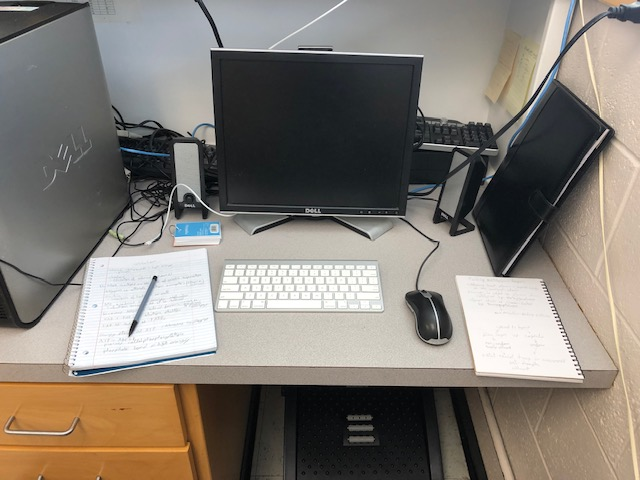

### Educational Experience

Growing up, I was homeschooled by my mom until I reached college. I attended Parkland Community College originally and graduated from there with an Associate in Science with Honors in 2017. I then transferred to the University of Illinois at Urbana-Champaign and graduated with a Bachelor of Science in Molecular and Cellular Biology with Academic Distinction in 2019. 

During my senior year of college, I was an undergrad chemistry TA, teaching primarily general chemistry labs. After graduating, I continued working as a chemistry TA for an additional three years. I then entered the Biological Sciences Ph.D program at the University of Tulsa in Fall 2022. 

### Research Background

I was originally a pre-med major, so I did not pursue any research experiences during undergrad. After I started teaching chemistry, I decided I would rather continue studying science instead of applying to medical schools. I then worked in a neuroscience lab at UIUC for a brief period in addition to my job as a chemistry TA. 

I am now a graduate student in Dr. Fakhr's lab at the University of Tulsa, where we study foodborne pathogens. I'm currently working on writing my first literature review, and I am shadowing Dr. Karki to learn lab techniques as he studies the aerotolerance of *Campylobacter* bacteria. 

  

[Research Advisor's Website](https://scholar.google.com/citations?user=BwpdOWQAAAAJ&hl=en)

### Assignments

| Date | Name | Link
| :------------- | :------------- | :-------------
| 8/29/22   | Github Intro & Portfolio | [Assignment 1](Assignments/Assignment1.html)
| 9/5/22   | Portfolio | [Assignment 2](index.html)
| 9/12/22   | Regular Expressions | [Assignment 3](Assignments/Assignment3.html)
| 9/26/22   | Tibbles | [Assignment 4](Assignments/Assignment-4.html)
| 9/26/22   | Tidyr and Merge | [Assignment 5](Assignments/Assignment-5/Assignment-5.html)
| 10/17/22   | GIS | [Assignment 7](Assignments/GIS Lesson/Assignment-7.html)
| 10/26/22   | AcuityView | [AcuityView Assignment](Assignments/AcuityView/AcuityView.html)
| 11/10/22   | Rentrez | [Rentrez Assignment](Assignments/Assignment-10.html)
| 11/28/22   | R Packages | [R Packages Lesson](RPackagesLesson/Creating-R-Packages-Lesson.html)

